<p align="center">
  <picture>
    <source media="(prefers-color-scheme: dark)" srcset="assets/logo-dark.svg">
    <source media="(prefers-color-scheme: light)" srcset="assets/logo-light.svg">
    
  </picture>
</p>

<h1 align="center">EFKA - Embed-Free Knowledge Agent</h1>

<p align="center">
  <em>AI-powered knowledge management without vector embeddings. File system based, Agent driven. Maybe slower, but results are much more reliable!</em>
</p>

[](LICENSE)
[](https://www.python.org/)
[](https://github.com/anthropics/claude-code)

## Why EFKA?

Traditional RAG systems rely on vector embeddings and similarity search, which can miss context and produce hallucinations. EFKA takes a different approach:

- **No Embeddings**: Direct file system access, no vector database needed
- **Agent-First**: Let the AI agent intelligently search and combine information
- **Transparent**: You can read the same files the agent reads
- **Reliable**: No semantic drift or embedding quality issues

## EFKA vs. Traditional Embedding-based RAG


EFKA represents a paradigm shift from traditional embedding-based RAG systems. Instead of fragmenting documents into chunks and relying on similarity search, EFKA adopts a human-like, tree-search approach that directly interacts with your knowledge base files.

### The Limitations of Traditional Embedding-based RAG

Traditional RAG systems face several fundamental challenges:

1. **Information Fragmentation**: Documents must be split into chunks, which disrupts logical flow and context. Important information often spans multiple chunks, making it difficult to reconstruct complete answers.

2. **Chunking Strategy Dependency**: Quality heavily depends on chunking strategies (size, overlap, semantic boundaries). Poor chunking leads to information loss or irrelevant retrieval.

3. **Incomplete Context**: Even with similarity search, there's no guarantee that retrieved chunks contain all information needed to answer a query. Critical context may be missing.

4. **Similarity Threshold Problems**: Setting appropriate similarity thresholds is challenging – too high misses relevant information, too low retrieves noise.

5. **Embedding Model Complexity**: Requires deploying and maintaining embedding models (and often rerankers), adding infrastructure complexity and maintenance overhead.

6. **Domain Adaptation Issues**: General-purpose embeddings may not capture domain-specific semantics, leading to poor retrieval quality in specialized fields.

7. **High Update Cost**: Adding or modifying documents requires re-embedding and re-indexing the entire dataset, which is resource-intensive.

8. **Cost Considerations**: Commercial embedding APIs incur ongoing costs, while local models require significant GPU resources.

### EFKA's Human-Like Search Strategy

EFKA mimics how humans actually search for information:

1. **Tree-Structured Exploration**: Starts with the knowledge base directory structure, identifies relevant files, then drills down as needed – just like a person browsing files.

2. **On-Demand Deep Dives**: For large documents, first examines the table of contents or structure, then focuses on relevant sections. Small documents are read entirely.

3. **Transparent and Explainable**: You can see exactly which files the agent reads, providing full traceability and trust.

4. **No Embedding Models Needed**: Leverages the LLM's reasoning capabilities directly, eliminating embedding model dependencies and associated complexities.

5. **Multi-Modal Support**: Naturally handles images, tables, and formatted content within documents without special processing pipelines.

6. **Incremental Updates**: Simply add new files to the knowledge base – no re-embedding or re-indexing required.

7. **Context Preservation**: Maintains document structure and logical flow by reading complete sections rather than fragmented chunks.

### Performance and Speed Considerations

While traditional RAG systems can be faster for simple lookups, EFKA achieves near-real-time performance (typically under 10 seconds) through:

- **FAQ System**: Caches frequent questions and answers, bypassing full searches for common queries
- **Directory Summaries**: Maintains summaries of document structures for quick navigation
- **Intelligent Caching**: Remembers previous searches and their results
- **Expert Routing**: Directs queries to the most relevant knowledge areas first

This optimized approach makes EFKA suitable for interactive applications while maintaining the accuracy and completeness advantages of human-like search.

## Features

- **Intelligent Q&A**: 6-stage retrieval strategy with expert routing - accurate answers with source attribution
- **Smart Document Ingestion**: Automatic format conversion, semantic conflict detection, intelligent file placement
- **FAQ System**: Automatic learning from interactions, usage tracking, and optimization
- **Multi-Channel Support**: Web UI + Enterprise IM platforms (WeChat Work, Feishu, DingTalk, Slack)
- **Dual-Agent Architecture**: Separate agents optimized for admin tasks and employee queries
- **Streaming Responses**: Real-time SSE streaming with Markdown rendering

## Agent Workflow


### Admin Agent Flow

```mermaid
flowchart TD
    subgraph Intent["🎯 Intent Recognition"]
        A[User Request] --> B{Intent Type?}
    end

    subgraph DocIngest["📥 Document Ingestion"]
        B -->|Upload/Add/Import| C1[1. Validate Format]
        C1 -->|MD/TXT| C3
        C1 -->|Excel| C2a[Keep Original + Generate Metadata]
        C1 -->|DOC/PDF/PPT| C2b[smart_convert.py]
        C2a --> C3[3. Semantic Conflict Detection]
        C2b --> C3
        C3 -->|Conflict| C3x[Report & Suggest Adjustment]
        C3 -->|No Conflict| C4[4. Determine Target Location]
        C4 --> C5[5. Write & Update README.md]
        C5 -->|Large File| C5a[Generate TOC Overview]
    end

    subgraph KBMgmt["📚 KB Management"]
        B -->|View/List/Stats| D1[Read README/FAQ/Stats]
        B -->|Delete| D2[Show Details & Request Confirm]
        D2 -->|User Confirms| D3[Delete & Update README]
        D2 -->|User Cancels| D4[Abort]
    end

    subgraph BatchNotify["📢 Batch Notification"]
        B -->|Notify/Send| E1[Read Employee Mapping]
        E1 --> E2[Filter Target Employees]
        E2 --> E3[Build Message & Preview]
        E3 -->|User Confirms| E4[Batch Send via WeWork]
    end

    style Intent fill:#e1f5fe
    style DocIngest fill:#f3e5f5
    style KBMgmt fill:#e8f5e9
    style BatchNotify fill:#fff3e0
```



### Employee Agent Flow

```mermaid
flowchart TD
    subgraph Query["🔍 6-Stage Knowledge Retrieval"]
        A[User Query] --> B[1. FAQ Quick Match]
        B -->|Found| B1[Return FAQ Answer]
        B -->|Not Found| C[2. Navigate via README.md]
        C --> D{Target Files?}
        D -->|Identified| E[3. Smart File Read]
        D -->|Unclear| F[4. Keyword Search]
        E -->|Small File| E1[Read Full Content]
        E -->|Large File| E2[Read TOC → Target Section]
        E1 & E2 --> G{Answer Found?}
        F -->|Max 3 Attempts| G
        G -->|Yes| H[5. Generate Answer + Source]
        G -->|No| I[6. Expert Routing]
    end

    subgraph Expert["👨‍💼 Expert Routing"]
        I --> I1[Identify Domain]
        I1 --> I2[Query domain_experts.xlsx]
        I2 --> I3[Notify Expert via WeWork]
        I3 --> I4[Inform User to Wait]
    end

    subgraph Feedback["💬 Satisfaction Feedback"]
        H --> J[User Feedback]
        J -->|Satisfied + From FAQ| K1[Update FAQ Usage Count]
        J -->|Satisfied + From KB| K2[Add to FAQ]
        J -->|Unsatisfied + Has Reason| K3[Update FAQ Content]
        J -->|Unsatisfied + No Reason| K4[Remove FAQ + Log BADCASE]
    end

    style Query fill:#e3f2fd
    style Expert fill:#fce4ec
    style Feedback fill:#f1f8e9
```



## Architecture

```
┌──────────────────────────────────────────────────────┐
│  Frontend Layer                                       │
│  ┌─────────────┐  ┌──────────────────────────────┐  │
│  │  Web UI     │  │  IM Platforms                │  │
│  │  (3000)     │  │  WeWork / Feishu / DingTalk  │  │
│  └──────┬──────┘  └──────────────┬───────────────┘  │
│         └────────────┬───────────┘                   │
├──────────────────────┼───────────────────────────────┤
│  Backend (FastAPI)   │                               │
│  ┌─────────────┐  ┌──┴──────────┐                   │
│  │ Admin Agent │  │ Employee    │                   │
│  │ - Doc Mgmt  │  │ Agent       │                   │
│  │ - KB Admin  │  │ - Q&A       │                   │
│  │ - Notify    │  │ - Routing   │                   │
│  └─────────────┘  └─────────────┘                   │
├──────────────────────────────────────────────────────┤
│  Infrastructure: Redis | Knowledge Base | Channels   │
└──────────────────────────────────────────────────────┘
```

## Quick Start

### Prerequisites

- Python 3.10+
- Node.js 18+
- Redis 7+
- Claude API Key
- Pandoc (for document conversion)
  - macOS: `brew install pandoc`
  - Ubuntu: `apt-get install pandoc`

### Installation

```bash
# Clone the repository
git clone https://github.com/anthropics/efka.git
cd efka

# Configure environment
cp .env.example .env
# Edit .env with your Claude API Key and other settings

# Install backend dependencies
python -m venv venv
source venv/bin/activate  # Windows: venv\Scripts\activate
pip install -r backend/requirements.txt

# Install frontend dependencies
cd frontend && npm install && cd ..

# Start services
./scripts/start.sh
```

Access the application:
- **Web UI**: http://localhost:3000
- **API**: http://localhost:8000/health

Stop services: `./scripts/stop.sh`

### Docker Deployment

```bash
cp .env.example .env
# Edit .env with your configuration

docker-compose up -d
```

## Configuration

Key environment variables (see `.env.example` for full list):

| Variable | Description | Required |
|----------|-------------|----------|
| `CLAUDE_API_KEY` | Claude API key | Yes |
| `KB_ROOT_PATH` | Knowledge base directory | No (default: ./knowledge_base) |
| `REDIS_HOST` | Redis host | No (default: localhost) |
| `WEWORK_CORP_ID` | WeChat Work Corp ID | For WeWork integration |

> **💡 Alternative Models**: If you don't have an Anthropic API key, you can use compatible models such as DeepSeek V3.2, GLM 4.6, Minimax M2, Kimi K2, Doubao-Seed-Code, etc. Simply configure `ANTHROPIC_BASE_URL` and `ANTHROPIC_AUTH_TOKEN` in your `.env` file. Please search online for specific setup tutorials for your chosen provider.
>
> **⚠️ Thinking Mode**: Extended thinking is disabled by default because third-party API providers (DeepSeek, GLM, Minimax, etc.) may not yet support the Claude Agent SDK's thinking mode response format. If you're using the official Anthropic API and want to enable thinking, modify `max_thinking_tokens` in `backend/services/kb_service_factory.py`.

### IM Platform Integration

The system supports multiple IM platforms through a pluggable Channel Adapter architecture:

```bash
# WeChat Work
ENABLE_WEWORK=auto
WEWORK_CORP_ID=your_corp_id
WEWORK_CORP_SECRET=your_secret
WEWORK_AGENT_ID=your_agent_id
```

See [Channel Development Guide](docs/CHANNELS.md) for adding new platforms.

## Project Structure

```
efka/
├── backend/
│   ├── agents/          # Agent definitions (Admin + Employee)
│   ├── api/             # FastAPI routes
│   ├── channels/        # IM platform adapters
│   ├── services/        # Business logic
│   ├── tools/           # Custom tools (image_read, etc.)
│   └── utils/           # Utilities
├── frontend/            # React Web UI
├── knowledge_base/      # Document storage
│   └── skills/          # Agent skills (auto-copied on startup)
├── skills/              # Skills source (smart_convert.py, prompts)
├── scripts/             # Deployment scripts
├── docs/                # Documentation
└── wework-mcp/          # WeChat Work MCP server (submodule)
```

### Skills Directory

The `skills/` directory contains tools and prompts that agents need to access:
- `smart_convert.py` - Document format converter (DOC/PDF/PPT → Markdown)
- `batch_notification.md` - Batch notification workflow guide

**Important**: These files must be copied to `knowledge_base/skills/` before use:
- **Automatic**: The `scripts/deploy.sh` script will auto-copy during deployment
- **Manual**: Run `cp -r skills/ knowledge_base/skills/`

This design ensures agents only access files within the knowledge base directory boundary.

## Documentation

- [Deployment Guide](docs/DEPLOYMENT.md) - Production deployment instructions
- [Channel Development Guide](docs/CHANNELS.md) - Adding new IM platform support

## Tech Stack

- **Backend**: Python / FastAPI / Claude Agent SDK / Redis
- **Frontend**: React 18 / Vite / Tailwind CSS
- **AI**: Claude (via Agent SDK)
- **Document Processing**: PyMuPDF / pypandoc / PaddleOCR

## Contributing

Contributions are welcome! Please feel free to submit issues and pull requests.

## License

This project is licensed under the MIT License - see the [LICENSE](LICENSE) file for details.

## Acknowledgments

Built with [Claude Agent SDK](https://github.com/anthropics/claude-code) by Anthropic.
