<p align="center">
  <picture>
    <source media="(prefers-color-scheme: dark)" srcset="assets/logo-dark.svg">
    <source media="(prefers-color-scheme: light)" srcset="assets/logo-light.svg">
    
  </picture>
</p>

<h1 align="center">EFKA 知了 - Embed-Free Knowledge Agent</h1>

<p align="center">
  <em>AI-powered knowledge management without vector embeddings. File system based, Agent driven. Maybe slower, but results are much more reliable!</em>
</p>

<p align="center">
  <strong>知了</strong> (Zhīliǎo, Chinese for "Cicada") - The name symbolizes clear, resonant communication of knowledge.
</p>

[](LICENSE)
[](https://www.python.org/)
[](https://github.com/anthropics/claude-code)

English | [中文](README_CN.md)

<p align="center">
  
</p>

## Why EFKA?

Traditional RAG systems rely on vector embeddings and similarity search, which can miss context and produce hallucinations. EFKA takes a different approach:

- **No Embeddings**: Direct file system access, no vector database needed
- **Agent-First**: Let the AI agent intelligently search and combine information
- **Transparent**: You can read the same files the agent reads
- **Reliable**: No semantic drift or embedding quality issues

## EFKA vs. Traditional Embedding-based RAG

<p align="center">
  
</p>

EFKA represents a paradigm shift from traditional embedding-based RAG systems. Instead of fragmenting documents into chunks and relying on similarity search, EFKA adopts a human-like, tree-search approach that directly interacts with your knowledge base files.


| Dimension | Traditional RAG | EFKA | Example |
|-----------|-----------------|------|---------|
| **Information Integrity** | Documents split into chunks, disrupting logical flow | Reads complete sections, preserving context | *Querying "employee onboarding process": Traditional RAG retrieves scattered chunks from HR policy, missing the required sequence. EFKA reads the full onboarding guide and provides step-by-step instructions.* |
| **Chunking Strategy** | Quality depends heavily on chunk size/overlap settings | No chunking required | *A 50-page technical manual: Traditional RAG must tune chunk sizes (too small loses context, too large retrieves noise). EFKA navigates via TOC to the relevant section.* |
| **Context Completeness** | No guarantee retrieved chunks contain all needed info | Follows document structure to gather complete context | *"What's the refund policy for enterprise customers?" Traditional RAG may only retrieve general refund rules, missing the enterprise-specific exceptions in a later paragraph. EFKA reads the entire policy section.* |
| **Similarity Threshold** | Hard to tune – too high misses info, too low adds noise | Uses LLM reasoning, no threshold tuning | *Searching for "API rate limits": Traditional RAG may miss "request throttling" (different wording). EFKA understands synonyms and finds all related content.* |
| **Information Aggregation** | Cannot reliably aggregate semantically similar content | Agent intelligently synthesizes across documents | *"Summarize Q1-Q3 weekly reports into a quarterly summary": Traditional RAG retrieves all weekly reports (semantically identical) but cannot distinguish which weeks belong to which month. EFKA reads each report, extracts dates, and organizes by time period.* |
| **Knowledge Base Quality Control** | No ingestion-time quality enforcement; conflicting content may coexist | Strict ingestion standards with conflict detection | *Two policy documents with contradictory vacation rules: Traditional RAG stores both, causing inconsistent answers. EFKA's Admin Agent detects conflicts during ingestion and requires resolution before adding.* |
| **Infrastructure Complexity** | Requires embedding models + vector DB + often rerankers | Only needs LLM API | *Setting up a new knowledge base: Traditional RAG needs Pinecone/Milvus/Weaviate + embedding model deployment. EFKA just needs a folder of files.* |
| **Domain Adaptation** | General embeddings may miss domain-specific semantics | LLM understands domain context directly | *Medical knowledge base: "MI" means "myocardial infarction" not "Michigan". Traditional RAG may confuse these; EFKA understands from context.* |
| **Update Cost** | Adding/modifying docs requires re-embedding entire dataset | Just add/edit files, no re-indexing | *Adding 100 new documents: Traditional RAG must re-embed and update vector indices. EFKA: just copy files to the knowledge base folder.* |
| **Multi-Modal Support** | Requires separate pipelines for images/tables | Native support via LLM vision capabilities | *Document with embedded diagrams: Traditional RAG often ignores images. EFKA can read and interpret diagrams in context.* |
| **Transparency** | Black-box similarity scores | Full visibility into which files are read | *Debugging wrong answers: Traditional RAG shows similarity scores that are hard to interpret. EFKA shows exactly which files and sections were consulted.* |

## Features

- **Intelligent Q&A**: 6-stage retrieval strategy with expert routing - accurate answers with source attribution
- **Smart Document Ingestion**: Automatic format conversion, semantic conflict detection, intelligent file placement
- **FAQ System**: Automatic learning from interactions, usage tracking, and optimization
- **Multi-Channel Support**: Web UI + Enterprise IM platforms (WeChat Work, Feishu, DingTalk, Slack)
- **Dual-Agent Architecture**: Separate agents optimized for admin tasks and user queries
- **Streaming Responses**: Real-time SSE streaming with Markdown rendering
- **Progressive README Layering**: Auto-generates hierarchical README structure as knowledge base grows, ensuring fast navigation at any scale

## Limitations and Use Cases

### Limitations

While EFKA provides more reliable and accurate answers compared to traditional RAG systems, it has some inherent limitations:

1. **Latency**: Response times are longer than traditional RAG, typically in the 10-30 second range. The system aims for near-real-time performance but cannot match the sub-second response times of embedding-based systems.

2. **Token Consumption**: The agent-based approach consumes more tokens as it reads entire documents or sections. This requires more powerful models and results in higher API costs compared to simple similarity search.

3. **Concurrency Architecture**: Because the Claude Agent SDK wraps CLI processes, each conversation requires a separate CLI process. While EFKA implements a client pool for concurrency management, this approach is less elegant than traditional API-based systems. Related issue: [#333](https://github.com/anthropics/claude-agent-sdk-python/issues/333).

### Suitable Use Cases

EFKA is best suited for scenarios where:

- **Accuracy over Speed**: When answer quality and reliability are more important than response time
- **Low to Moderate Frequency**: For occasional or periodic queries rather than high-volume, real-time interactions
- **Knowledge-Intensive Domains**: Complex domains where context preservation and complete information retrieval are critical
- **Transparency Requirements**: When users need to verify information sources and understand the reasoning process

### Not Suitable For

- **Real-Time Chat**: Applications requiring sub-second response times
- **High-Frequency Queries**: Scenarios with thousands of queries per hour where cost would be prohibitive
- **Simple FAQ Lookups**: When a traditional vector database would be sufficient and faster

Understanding these trade-offs helps determine when EFKA is the right solution for your knowledge management needs.

## Agent Workflow

### Admin Agent Flow

```mermaid
flowchart TD
    subgraph Intent["🎯 Intent Recognition"]
        A[User Request] --> B{Intent Type?}
    end

    subgraph DocIngest["📥 Document Ingestion"]
        B -->|Upload/Add/Import| C1[1. Validate Format]
        C1 -->|MD/TXT| C3
        C1 -->|Excel| C2a[Keep Original + Generate Metadata]
        C1 -->|DOC/PDF/PPT| C2b[smart_convert.py]
        C2a --> C3[3. Semantic Conflict Detection]
        C2b --> C3
        C3 -->|Conflict| C3x[Report & Suggest Adjustment]
        C3 -->|No Conflict| C4[4. Determine Target Location]
        C4 --> C5[5. Write & Update README.md]
        C5 -->|Large File| C5a[Generate TOC Overview]
    end

    subgraph KBMgmt["📚 KB Management"]
        B -->|View/List/Stats| D1[Read README/FAQ/Stats]
        B -->|Delete| D2[Show Details & Request Confirm]
        D2 -->|User Confirms| D3[Delete & Update README]
        D2 -->|User Cancels| D4[Abort]
    end

    subgraph BatchNotify["📢 Batch Notification (Requires IM Integration)"]
        B -->|Notify/Send| E1[Read User Mapping]
        E1 --> E2[Filter Target Users]
        E2 --> E3[Build Message & Preview]
        E3 -->|User Confirms| E4[Batch Send via IM]
    end

    style Intent fill:#e1f5fe
    style DocIngest fill:#f3e5f5
    style KBMgmt fill:#e8f5e9
    style BatchNotify fill:#fff3e0
```



### User Agent Flow

```mermaid
flowchart TD
    subgraph Query["🔍 6-Stage Knowledge Retrieval"]
        A[User Query] --> B[1. FAQ Quick Match]
        B -->|Found| B1[Return FAQ Answer]
        B -->|Not Found| C[2. Navigate via README.md]
        C --> D{Target Files?}
        D -->|Identified| E[3. Smart File Read]
        D -->|Unclear| F[4. Keyword Search]
        E -->|Small File| E1[Read Full Content]
        E -->|Large File| E2[Read TOC → Target Section]
        E1 & E2 --> G{Answer Found?}
        F -->|Max 3 Attempts| G
        G -->|Yes| H[5. Generate Answer + Source]
        G -->|No| I[6. Expert Routing]
    end

    subgraph Expert["👨‍💼 Expert Routing (Requires IM Integration)"]
        I --> I1[Identify Domain]
        I1 --> I2[Query domain_experts.xlsx]
        I2 --> I3[Notify Expert via IM]
        I3 --> I4[Inform User to Wait]
    end

    subgraph Feedback["💬 Satisfaction Feedback"]
        H --> J[User Feedback]
        J -->|Satisfied + From FAQ| K1[Update FAQ Usage Count]
        J -->|Satisfied + From KB| K2[Add to FAQ]
        J -->|Unsatisfied + Has Reason| K3[Update FAQ Content]
        J -->|Unsatisfied + No Reason| K4[Remove FAQ + Log BADCASE]
    end

    style Query fill:#e3f2fd
    style Expert fill:#fce4ec
    style Feedback fill:#f1f8e9
```



## Architecture

```
┌──────────────────────────────────────────────────────┐
│  Frontend Layer                                       │
│  ┌─────────────┐  ┌──────────────────────────────┐  │
│  │  Web UI     │  │  IM Platforms                │  │
│  │  (3000)     │  │  WeWork / Feishu / DingTalk  │  │
│  └──────┬──────┘  └──────────────┬───────────────┘  │
│         └────────────┬───────────┘                   │
├──────────────────────┼───────────────────────────────┤
│  Backend (FastAPI)   │                               │
│  ┌─────────────┐  ┌──┴──────────┐                   │
│  │ Admin Agent │  │ User        │                   │
│  │ - Doc Mgmt  │  │ Agent       │                   │
│  │ - KB Admin  │  │ - Q&A       │                   │
│  │ - Notify    │  │ - Routing   │                   │
│  └─────────────┘  └─────────────┘                   │
├──────────────────────────────────────────────────────┤
│  Infrastructure: Redis | Knowledge Base | Channels   │
└──────────────────────────────────────────────────────┘
```

## Quick Start

### Prerequisites

- Python 3.10+
- Node.js 20.19+ (required by Vite 7.x)
- Claude Code CLI
  - Install: `npm install -g @anthropic-ai/claude-code`
- Redis 7+ (optional, uses memory storage if not installed)
  - macOS: `brew install redis && brew services start redis`
  - Ubuntu: `sudo apt-get install redis-server && sudo systemctl start redis`
- Claude API Key
- Pandoc (for document conversion)
  - macOS: `brew install pandoc`
  - Ubuntu: `apt-get install pandoc`

### Installation

```bash
# Clone the repository
git clone https://github.com/Harryoung/efka.git
cd efka

# Configure environment
cp .env.example .env
# Edit .env with your Claude API Key and other settings

# Install backend dependencies
python -m venv venv
source venv/bin/activate  # Windows: venv\Scripts\activate
pip install -r backend/requirements.txt

# Install frontend dependencies
cd frontend && npm install && cd ..

# Start services
./scripts/start.sh
```

Access the application:
- **Admin UI**: http://localhost:3000 (knowledge base management)
- **User UI**: http://localhost:3001 (Q&A interface)
- **API**: http://localhost:8000/health

Stop services: `./scripts/stop.sh`

### Docker Deployment

```bash
cp .env.example .env
# Edit .env with your configuration

docker compose up -d
```

## Configuration

Key environment variables (see `.env.example` for full list):

| Variable | Description | Required |
|----------|-------------|----------|
| `CLAUDE_API_KEY` or `ANTHROPIC_AUTH_TOKEN` | Claude API authentication (choose one) | Yes |
| `ANTHROPIC_BASE_URL` | API Base URL (required when using AUTH_TOKEN) | Conditional |
| `KB_ROOT_PATH` | Knowledge base directory | No (default: ./knowledge_base) |
| `REDIS_HOST` | Redis host | No (default: localhost) |
| `WEWORK_CORP_ID` | WeChat Work Corp ID | For WeWork integration |

> **💡 Alternative Models**: If you don't have an Anthropic API key, you can use compatible models such as DeepSeek V3.2, GLM 4.6, Minimax M2, Kimi K2, Doubao-Seed-Code, etc. Simply configure `ANTHROPIC_BASE_URL` and `ANTHROPIC_AUTH_TOKEN` in your `.env` file. Please search online for specific setup tutorials for your chosen provider.
>
> **⚠️ Thinking Mode**: Extended thinking is disabled by default because third-party API providers (DeepSeek, GLM, Minimax, etc.) may not yet support the Claude Agent SDK's thinking mode response format. If you're using the official Anthropic API and want to enable thinking, modify `max_thinking_tokens` in `backend/services/kb_service_factory.py`.

### Run Mode Configuration (v3.0)

EFKA v3.0 introduces explicit run mode configuration. By default, it runs in **standalone** mode (Web-only). To enable IM integration, configure `RUN_MODE`:

```bash
# Standalone mode (default) - Pure Web, no IM integration
./scripts/start.sh

# WeChat Work mode
./scripts/start.sh --mode wework

# Or via environment variable
RUN_MODE=wework ./scripts/start.sh
```

**Available modes**: `standalone`, `wework`, `feishu`, `dingtalk`, `slack`

**Note**: Only one IM channel can be active at a time (single-channel mutual exclusivity).

### IM Platform Integration

Configure the corresponding environment variables for your chosen IM platform:

```bash
# Run mode
RUN_MODE=wework

# WeChat Work configuration
WEWORK_CORP_ID=your_corp_id
WEWORK_CORP_SECRET=your_secret
WEWORK_AGENT_ID=your_agent_id
```

See [Channel Development Guide](docs/CHANNELS.md) for adding new platforms.

## Project Structure

```
efka/
├── skills/              # Agent skills (SDK native mechanism)
├── backend/
│   ├── agents/          # Agent definitions (Admin + User)
│   ├── api/             # FastAPI routes
│   ├── channels/        # IM platform adapters
│   ├── services/        # Business logic
│   ├── tools/           # Custom tools (image_read, etc.)
│   └── utils/           # Utilities
├── frontend/            # React Web UI
├── knowledge_base/      # Document storage
│   └── .claude/skills/  # Agent skills (auto-copied on startup)
├── scripts/             # Deployment scripts
├── docs/                # Documentation
└── wework-mcp/          # WeChat Work MCP server (submodule)
```

### Skills Directory

The `skills/` directory contains Agent skills using Claude Agent SDK's native mechanism:
- `batch-notification/` - Batch user notification workflow
- `document-conversion/` - Document format converter (DOC/PDF/PPT → Markdown)
- `excel-parser/` - Smart Excel/CSV parsing with automatic complexity-based strategy selection
- `expert-routing/` - Domain expert routing
- `large-file-toc/` - Large file table of contents generation
- `satisfaction-feedback/` - User satisfaction feedback handling

**Important**: These files are automatically copied from `skills/` to `knowledge_base/.claude/skills/` on startup to ensure agents only access files within the knowledge base directory boundary.

## Documentation

- [Deployment Guide](docs/DEPLOYMENT.md) - Production deployment instructions
- [Channel Development Guide](docs/CHANNELS.md) - Adding new IM platform support

## Roadmap

### IM Platform Integrations

Currently only **WeChat Work** is fully implemented. The following platforms are planned:

| Platform | Status | Notes |
|----------|--------|-------|
| WeChat Work | ✅ Implemented | Full feature support |
| Feishu (Lark) | 🔜 Planned | Event subscription + message API |
| DingTalk | 🔜 Planned | Robot callback + message push |
| Slack | 🔜 Planned | Slack App with Events API |

Each platform will implement `BaseChannelAdapter` interface. See [Channel Development Guide](docs/CHANNELS.md) for implementation details.

### Enterprise Access Control System

**Goal**: Fine-grained file-level permission control for multi-tenant enterprise deployments.

**Core Design**: Leverage Claude Agent SDK's `PreToolUse` hook to intercept `Read` / `Glob` / `Grep` tool calls and enforce permission checks before file access.

```
┌─────────────────────────────────────────────────────────┐
│  PreToolUse Hook (Permission Gate)                      │
│  ┌─────────────────────────────────────────────────┐    │
│  │  1. Extract file paths from tool input          │    │
│  │  2. Query permission service (user → ACL)       │    │
│  │  3. ALLOW / DENY / FILTER (partial access)      │    │
│  └─────────────────────────────────────────────────┘    │
├─────────────────────────────────────────────────────────┤
│  Permission Service                                     │
│  ├─ User identity (from session / IM context)          │
│  ├─ Role → Permission mapping (RBAC)                   │
│  ├─ File / Directory ACL rules                         │
│  └─ Audit logging                                       │
└─────────────────────────────────────────────────────────┘
```

**Key Features**:
- **Path-based ACL**: Define allow/deny rules at directory or file level
- **Role-Based Access Control (RBAC)**: Map users to roles, roles to permissions
- **IM-aware Identity**: Auto-resolve user identity from WeChat Work / Feishu / DingTalk context
- **Audit Trail**: Log all file access attempts for compliance

## Tech Stack

- **Backend**: Python / FastAPI / Claude Agent SDK / Redis
- **Frontend**: React 18 / Vite / Tailwind CSS
- **AI**: Claude (via Agent SDK)
- **Document Processing**: PyMuPDF / pypandoc / PaddleOCR

## Contributing

Contributions are welcome! Please feel free to submit issues and pull requests.

## License

This project is licensed under the MIT License - see the [LICENSE](LICENSE) file for details.

## Acknowledgments

Built with [Claude Agent SDK](https://github.com/anthropics/claude-code) by Anthropic.
