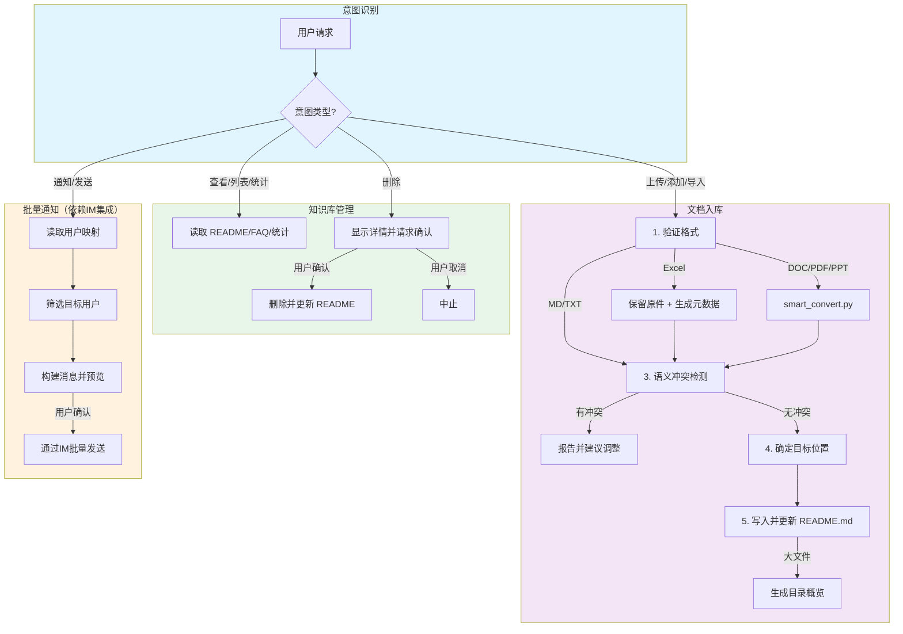
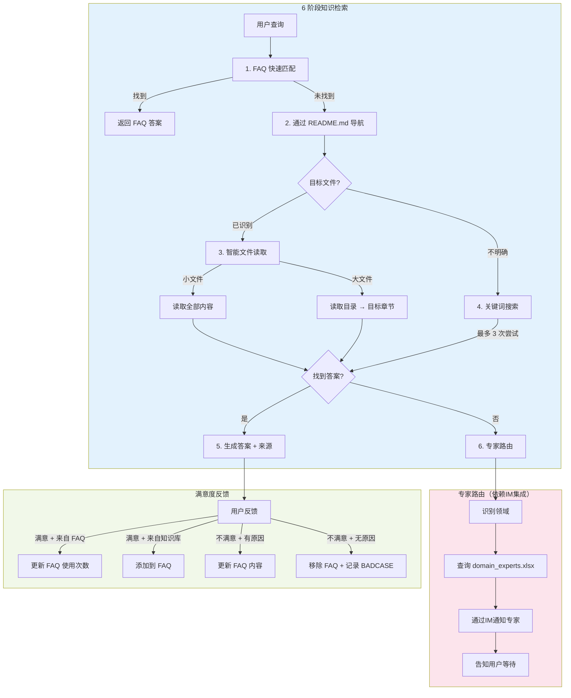

<p align="center">
  <picture>
    <source media="(prefers-color-scheme: dark)" srcset="assets/logo-dark.svg">
    <source media="(prefers-color-scheme: light)" srcset="assets/logo-light.svg">
    
  </picture>
</p>

<h1 align="center">知了 - 无向量知识库 Agent</h1>

<p align="center">
  <em>无需向量数据库的 AI 知识管理系统。基于文件系统，由 Agent 驱动。也许慢一点，但结果更可靠！</em>
</p>

<p align="center">
  <strong>EFKA</strong> (Embed-Free Knowledge Agent) - 英文缩写，意为"无向量知识库 Agent"
</p>

[](LICENSE)
[](https://www.python.org/)
[](https://github.com/anthropics/claude-code)

[English](README.md) | 中文

## 视频演示

[](https://www.bilibili.com/video/BV1mnmBBuEVe/)

## 为什么选择知了？

传统 RAG 系统依赖向量嵌入和相似度搜索，容易丢失上下文并产生幻觉。知了采用了不同的方法：

- **无需嵌入**：直接访问文件系统，无需向量数据库
- **Agent 优先**：让 AI Agent 智能搜索和整合信息
- **透明可见**：你可以看到 Agent 读取的每一个文件
- **结果可靠**：没有语义漂移或嵌入质量问题

## 知了 vs. 传统嵌入式 RAG


知了代表了一种从传统嵌入式 RAG 系统的范式转变。它不是将文档分割成碎片并依赖相似度搜索，而是采用类人的树状搜索方式，直接与你的知识库文件交互。


| 维度 | 传统 RAG | 知了 | 具体例子 |
|------|----------|------|----------|
| **信息完整性** | 文档切分成块，破坏逻辑流程 | 阅读完整章节，保留上下文 | *查询"员工入职流程"：传统 RAG 检索到 HR 政策的零散片段，缺失必要的顺序。知了读取完整的入职指南，提供按步骤的说明。* |
| **分块策略** | 质量严重依赖分块大小/重叠设置 | 无需分块 | *50 页技术手册：传统 RAG 必须调优分块大小（太小丢失上下文，太大检索噪声）。知了通过目录导航到相关章节。* |
| **上下文完整性** | 无法保证检索的分块包含所有所需信息 | 沿文档结构收集完整上下文 | *"企业客户的退款政策是什么？"传统 RAG 可能只检索到通用退款规则，遗漏后文的企业专属例外条款。知了读取整个政策章节。* |
| **相似度阈值** | 难以调优——太高漏信息，太低引入噪声 | 使用 LLM 推理，无需调阈值 | *搜索"API 速率限制"：传统 RAG 可能漏掉"请求节流"（不同措辞）。知了理解同义词，找到所有相关内容。* |
| **信息汇总** | 无法可靠地汇总语义相似的内容 | Agent 智能跨文档综合 | *"将 Q1-Q3 周报汇总成季报"：传统 RAG 检索到所有周报（语义极其相似），但无法区分哪些周属于哪个月。知了读取每份报告，提取日期，按时间段组织。* |
| **知识库质量控制** | 入库时不强制质量检查；矛盾内容可能共存 | 严格入库标准 + 冲突检测 | *两份政策文档中的年假规则相互矛盾：传统 RAG 同时存储，导致回答不一致。知了的管理员 Agent 在入库时检测冲突，要求先解决再添加。* |
| **基础设施复杂度** | 需要嵌入模型 + 向量数据库 + 常需重排序器 | 只需 LLM API | *搭建新知识库：传统 RAG 需要 Pinecone/Milvus/Weaviate + 嵌入模型部署。知了只需一个文件夹。* |
| **领域适应性** | 通用嵌入可能错过领域特定语义 | LLM 直接理解领域上下文 | *医疗知识库："MI"指"心肌梗塞"而非"密歇根州"。传统 RAG 可能混淆；知了根据上下文理解。* |
| **更新成本** | 添加/修改文档需重新嵌入整个数据集 | 直接添加/编辑文件，无需重建索引 | *添加 100 份新文档：传统 RAG 必须重新嵌入并更新向量索引。知了：复制文件到知识库文件夹即可。* |
| **多模态支持** | 需要独立的图片/表格处理流程 | 通过 LLM 视觉能力原生支持 | *含嵌入图表的文档：传统 RAG 常忽略图片。知了可以在上下文中阅读和解释图表。* |
| **透明度** | 黑盒式相似度分数 | 完全可见读取了哪些文件 | *调试错误答案：传统 RAG 展示难以解读的相似度分数。知了展示确切查阅了哪些文件和章节。* |

## 功能特性

- **智能问答**：6 阶段检索策略 + 专家路由——准确答案附带来源引用
- **智能文档入库**：自动格式转换、语义冲突检测、智能文件放置
- **FAQ 系统**：从交互中自动学习，使用量追踪和优化
- **多渠道支持**：Web UI + 企业 IM 平台（企业微信、飞书、钉钉、Slack）
- **双 Agent 架构**：分别优化管理任务和用户查询的 Agent
- **流式响应**：实时 SSE 流式传输，支持 Markdown 渲染
- **README 分层管理**：随知识库增长自动生成层级 README 结构，确保任意规模下的快速导航

## 局限性与适用场景

### 局限性

虽然知了相比传统 RAG 系统能提供更可靠、更准确的答案，但它也有一些固有的局限性：

1. **耗时偏长**：响应时间比传统 RAG 更长，通常在 10-30 秒范围内。系统致力于实现近实时性能，但无法达到基于嵌入的系统的亚秒级响应时间。

2. **Token 消耗较多**：基于 Agent 的方法会消耗更多 token，因为它会读取整个文档或章节。这需要更强大的模型，并导致比简单的相似度搜索更高的 API 成本。

3. **并发架构不够优雅**：由于 Claude Agent SDK 本质上是对 CLI 的包装，每个会话都必须有单独的 CLI 进程。虽然知了实现了 Client Pool 来管理并发，但这种做法不如传统的基于 API 的系统优雅。相关Issue: [#333](https://github.com/anthropics/claude-agent-sdk-python/issues/333)。

### 适用场景

知了最适合以下场景：

- **准确率优先于速度**：当答案质量和可靠性比响应时间更重要时
- **相对低频使用**：适用于偶尔或周期性的查询，而不是高并发、实时的交互
- **知识密集型领域**：需要保持上下文完整性和全面信息检索的复杂领域
- **透明度要求高**：当用户需要验证信息来源和理解推理过程时

### 不适用场景

- **实时聊天**：需要亚秒级响应时间的应用
- **超高频查询**：每小时数千次查询的场景，成本会变得难以承受
- **简单的 FAQ 查询**：当传统向量数据库已经足够且更快时

了解这些权衡有助于确定知了是否是适合你知识管理需求的正确解决方案。

## Agent 工作流程


### 管理员 Agent 流程



### 用户 Agent 流程



## 系统架构

```
┌──────────────────────────────────────────────────────┐
│  前端层                                               │
│  ┌─────────────┐  ┌──────────────────────────────┐  │
│  │  Web UI     │  │  IM 平台                     │  │
│  │  (3000)     │  │  企业微信 / 飞书 / 钉钉      │  │
│  └──────┬──────┘  └──────────────┬───────────────┘  │
│         └────────────┬───────────┘                   │
├──────────────────────┼───────────────────────────────┤
│  后端 (FastAPI)      │                               │
│  ┌─────────────┐  ┌──┴──────────┐                   │
│  │ 管理员      │  │ 用户        │                   │
│  │ Agent       │  │ Agent       │                   │
│  │ - 文档管理  │  │ - 问答      │                   │
│  │ - 知识库    │  │ - 专家      │                   │
│  │ - 通知      │  │   路由      │                   │
│  └─────────────┘  └─────────────┘                   │
├──────────────────────────────────────────────────────┤
│  基础设施: Redis | 知识库 | 渠道适配                  │
└──────────────────────────────────────────────────────┘
```

## 快速开始

### 前置要求

- Python 3.10+
- Node.js 18+
- Redis 7+
- Claude API Key
- Pandoc（用于文档转换）
  - macOS: `brew install pandoc`
  - Ubuntu: `apt-get install pandoc`

### 安装

```bash
# 克隆仓库
git clone https://github.com/Harryoung/efka.git
cd efka

# 配置环境
cp .env.example .env
# 编辑 .env，填入你的 Claude API Key 和其他设置

# 安装后端依赖
python -m venv venv
source venv/bin/activate  # Windows: venv\Scripts\activate
pip install -r backend/requirements.txt

# 安装前端依赖
cd frontend && npm install && cd ..

# 启动服务
cd efka  # 如果不在项目根目录，请先切换到项目目录
./scripts/start.sh
```

访问应用：
- **Web 界面**: http://localhost:3000
- **API**: http://localhost:8000/health

停止服务: `./scripts/stop.sh`

### Docker 部署

```bash
cp .env.example .env
# 编辑 .env 配置

docker-compose up -d
```

## 配置说明

主要环境变量（完整列表见 `.env.example`）：

| 变量 | 说明 | 必填 |
|------|------|------|
| `CLAUDE_API_KEY` | Claude API 密钥 | 是 |
| `KB_ROOT_PATH` | 知识库目录 | 否（默认: ./knowledge_base）|
| `REDIS_HOST` | Redis 主机 | 否（默认: localhost）|
| `WEWORK_CORP_ID` | 企业微信企业 ID | 企业微信集成时需要 |

> **替代模型**：如果没有 Anthropic API 密钥，可以使用兼容模型，如 DeepSeek V3.2、GLM 4.6、Minimax M2、Kimi K2、豆包-Seed-Code 等。只需在 `.env` 文件中配置 `ANTHROPIC_BASE_URL` 和 `ANTHROPIC_AUTH_TOKEN`。具体设置教程请自行搜索对应提供商的文档。
>
> **Thinking 模式**：默认禁用扩展思考模式，因为第三方 API 提供商（DeepSeek、GLM、Minimax 等）可能尚不支持 Claude Agent SDK 的 thinking 模式响应格式。如果你使用官方 Anthropic API 并希望启用 thinking，请修改 `backend/services/kb_service_factory.py` 中的 `max_thinking_tokens`。

### 运行模式配置（v3.0）

EFKA v3.0 引入了显式运行模式配置。默认以 **standalone** 模式运行（纯 Web）。要启用 IM 集成，请配置 `RUN_MODE`：

```bash
# Standalone 模式（默认）- 纯 Web，无 IM 集成
./scripts/start.sh

# 企业微信模式
./scripts/start.sh --mode wework

# 或通过环境变量
RUN_MODE=wework ./scripts/start.sh
```

**可用模式**：`standalone`、`wework`、`feishu`、`dingtalk`、`slack`

**注意**：同一时间只能激活一个 IM 渠道（单渠道互斥）。

### IM 平台集成

为所选的 IM 平台配置相应的环境变量：

```bash
# 运行模式
RUN_MODE=wework

# 企业微信配置
WEWORK_CORP_ID=your_corp_id
WEWORK_CORP_SECRET=your_secret
WEWORK_AGENT_ID=your_agent_id
```

添加新平台请参阅[渠道开发指南](docs/CHANNELS.md)。

## 项目结构

```
efka/
├── skills/              # Agent 技能（SDK 原生机制）
├── backend/
│   ├── agents/          # Agent 定义（管理员 + 用户）
│   ├── api/             # FastAPI 路由
│   ├── channels/        # IM 平台适配器
│   ├── services/        # 业务逻辑
│   ├── tools/           # 自定义工具（image_read 等）
│   └── utils/           # 工具函数
├── frontend/            # React Web 界面
├── knowledge_base/      # 文档存储
│   └── .claude/skills/  # Agent 技能（启动时自动复制）
├── scripts/             # 部署脚本
├── docs/                # 文档
└── wework-mcp/          # 企业微信 MCP 服务（子模块）
```

### Skills 目录

`skills/` 目录包含使用 Claude Agent SDK 原生机制的 Agent 技能：
- `batch-notification/` - 批量用户通知工作流
- `document-conversion/` - 文档格式转换器（DOC/PDF/PPT → Markdown）
- `excel-parser/` - 智能 Excel/CSV 解析，根据复杂度自动选择处理策略
- `expert-routing/` - 领域专家路由
- `large-file-toc/` - 大文件目录概要生成
- `satisfaction-feedback/` - 用户满意度反馈处理

**重要**：这些文件会在启动时自动从 `skills/` 复制到 `knowledge_base/.claude/skills/`，以确保 Agent 只能访问知识库目录边界内的文件。

## 文档

- [部署指南](docs/DEPLOYMENT.md) - 生产环境部署说明
- [渠道开发指南](docs/CHANNELS.md) - 添加新 IM 平台支持

## 技术栈

- **后端**: Python / FastAPI / Claude Agent SDK / Redis
- **前端**: React 18 / Vite / Tailwind CSS
- **AI**: Claude（通过 Agent SDK）
- **文档处理**: PyMuPDF / pypandoc / PaddleOCR

## 贡献

欢迎贡献！请随时提交 issue 和 pull request。

## 许可证

本项目基于 MIT 许可证 - 详见 [LICENSE](LICENSE) 文件。

## 致谢

基于 Anthropic 的 [Claude Agent SDK](https://github.com/anthropics/claude-code) 构建。
