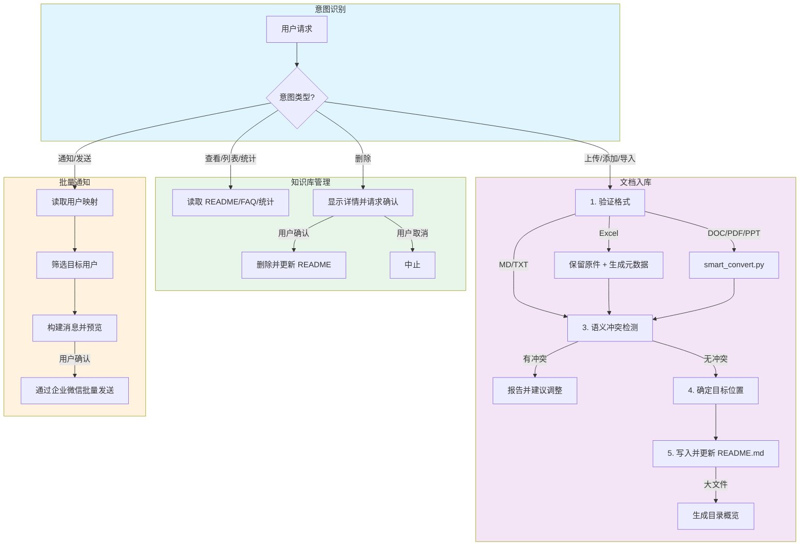
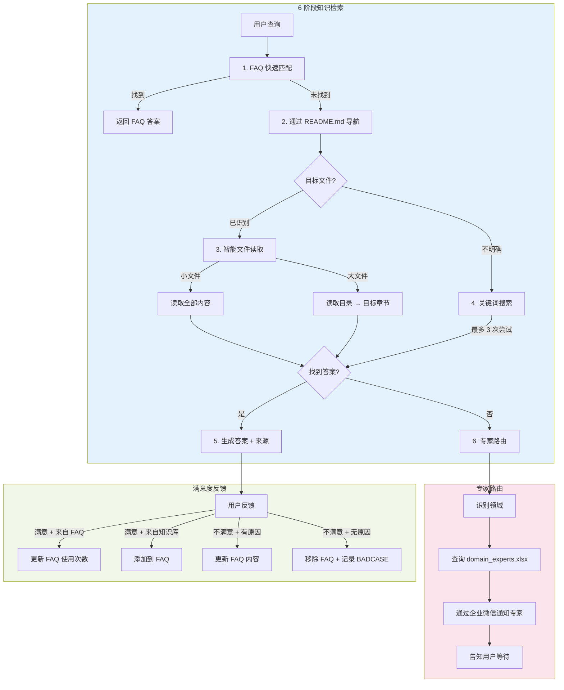

<p align="center">
  <picture>
    <source media="(prefers-color-scheme: dark)" srcset="assets/logo-dark.svg">
    <source media="(prefers-color-scheme: light)" srcset="assets/logo-light.svg">
    
  </picture>
</p>

<h1 align="center">知了 - 无向量知识库 Agent</h1>

<p align="center">
  <em>无需向量数据库的 AI 知识管理系统。基于文件系统，由 Agent 驱动。也许慢一点，但结果更可靠！</em>
</p>

<p align="center">
  <strong>EFKA</strong> (Embed-Free Knowledge Agent) - 英文缩写，意为"无向量知识库 Agent"
</p>

[](LICENSE)
[](https://www.python.org/)
[](https://github.com/anthropics/claude-code)

[English](README.md) | 中文

## 视频演示

[](https://www.bilibili.com/video/BV1mnmBBuEVe/)

## 为什么选择知了？

传统 RAG 系统依赖向量嵌入和相似度搜索，容易丢失上下文并产生幻觉。知了采用了不同的方法：

- **无需嵌入**：直接访问文件系统，无需向量数据库
- **Agent 优先**：让 AI Agent 智能搜索和整合信息
- **透明可见**：你可以看到 Agent 读取的每一个文件
- **结果可靠**：没有语义漂移或嵌入质量问题

## 知了 vs. 传统嵌入式 RAG


知了代表了一种从传统嵌入式 RAG 系统的范式转变。它不是将文档分割成碎片并依赖相似度搜索，而是采用类人的树状搜索方式，直接与你的知识库文件交互。

### 传统嵌入式 RAG 的局限性

传统 RAG 系统面临几个根本性挑战：

1. **信息碎片化**：文档必须切分成块，这会破坏逻辑流程和上下文。重要信息常常跨越多个分块，导致难以重建完整答案。

2. **分块策略依赖**：质量严重依赖分块策略（大小、重叠、语义边界）。糟糕的分块会导致信息丢失或检索不相关内容。

3. **上下文不完整**：即使通过相似度搜索，也无法保证检索到的分块包含回答问题所需的全部信息。关键上下文可能缺失。

4. **相似度阈值问题**：设置合适的相似度阈值很有挑战性——太高会错过相关信息，太低会检索到噪声。

5. **嵌入模型复杂性**：需要部署和维护嵌入模型（通常还需要重排序器），增加了基础设施复杂性和维护成本。

6. **领域适应问题**：通用嵌入可能无法捕捉特定领域的语义，导致专业领域检索质量差。

7. **更新成本高**：添加或修改文档需要重新嵌入和重新索引整个数据集，资源消耗大。

8. **成本考量**：商业嵌入 API 会持续产生费用，而本地模型需要大量 GPU 资源。

### 知了的类人搜索策略

知了模仿人类实际搜索信息的方式：

1. **树状结构探索**：从知识库目录结构开始，识别相关文件，然后按需深入——就像人浏览文件一样。

2. **按需深度阅读**：对于大型文档，先查看目录或结构，然后聚焦相关章节。小型文档则完整阅读。

3. **透明可解释**：你可以准确看到 Agent 读取了哪些文件，提供完全的可追溯性和信任。

4. **无需嵌入模型**：直接利用 LLM 的推理能力，消除嵌入模型依赖及相关复杂性。

5. **多模态支持**：自然处理文档中的图片、表格和格式化内容，无需特殊处理流程。

6. **增量更新**：只需将新文件添加到知识库——无需重新嵌入或重新索引。

7. **上下文保持**：通过阅读完整章节而非碎片化分块，保持文档结构和逻辑流程。

### 性能和速度考量

虽然传统 RAG 系统在简单查找时可能更快，但知了通过以下方式实现近实时性能（通常在 10 秒内）：

- **FAQ 系统**：缓存常见问题和答案，对高频查询跳过完整搜索
- **目录摘要**：维护文档结构摘要以便快速导航


这种优化方法使知了适合交互式应用，同时保持类人搜索的准确性和完整性优势。

### 局限性与适用场景

#### 局限性

虽然知了相比传统 RAG 系统能提供更可靠、更准确的答案，但它也有一些固有的局限性：

1. **耗时偏长**：响应时间比传统 RAG 更长，通常在 10-30 秒范围内。系统致力于实现近实时性能，但无法达到基于嵌入的系统的亚秒级响应时间。

2. **Token 消耗较多**：基于 Agent 的方法会消耗更多 token，因为它会读取整个文档或章节。这需要更强大的模型，并导致比简单的相似度搜索更高的 API 成本。

3. **并发架构不够优雅**：由于 Claude Agent SDK 本质上是对 CLI 的包装，每个会话都必须有单独的 CLI 进程。虽然知了实现了 Client Pool 来管理并发，但这种做法不如传统的基于 API 的系统优雅。

#### 适用场景

知了最适合以下场景：

- **准确率优先于速度**：当答案质量和可靠性比响应时间更重要时
- **相对低频使用**：适用于偶尔或周期性的查询，而不是高并发、实时的交互
- **知识密集型领域**：需要保持上下文完整性和全面信息检索的复杂领域
- **透明度要求高**：当用户需要验证信息来源和理解推理过程时

#### 不适用场景

- **实时聊天**：需要亚秒级响应时间的应用
- **超高频查询**：每小时数千次查询的场景，成本会变得难以承受
- **简单的 FAQ 查询**：当传统向量数据库已经足够且更快时

了解这些权衡有助于确定知了是否是适合你知识管理需求的正确解决方案。

## 功能特性

- **智能问答**：6 阶段检索策略 + 专家路由——准确答案附带来源引用
- **智能文档入库**：自动格式转换、语义冲突检测、智能文件放置
- **FAQ 系统**：从交互中自动学习，使用量追踪和优化
- **多渠道支持**：Web UI + 企业 IM 平台（企业微信、飞书、钉钉、Slack）
- **双 Agent 架构**：分别优化管理任务和用户查询的 Agent
- **流式响应**：实时 SSE 流式传输，支持 Markdown 渲染

## Agent 工作流程


### 管理员 Agent 流程



### 用户 Agent 流程



## 系统架构

```
┌──────────────────────────────────────────────────────┐
│  前端层                                               │
│  ┌─────────────┐  ┌──────────────────────────────┐  │
│  │  Web UI     │  │  IM 平台                     │  │
│  │  (3000)     │  │  企业微信 / 飞书 / 钉钉      │  │
│  └──────┬──────┘  └──────────────┬───────────────┘  │
│         └────────────┬───────────┘                   │
├──────────────────────┼───────────────────────────────┤
│  后端 (FastAPI)      │                               │
│  ┌─────────────┐  ┌──┴──────────┐                   │
│  │ 管理员      │  │ 用户        │                   │
│  │ Agent       │  │ Agent       │                   │
│  │ - 文档管理  │  │ - 问答      │                   │
│  │ - 知识库    │  │ - 专家      │                   │
│  │ - 通知      │  │   路由      │                   │
│  └─────────────┘  └─────────────┘                   │
├──────────────────────────────────────────────────────┤
│  基础设施: Redis | 知识库 | 渠道适配                  │
└──────────────────────────────────────────────────────┘
```

## 快速开始

### 前置要求

- Python 3.10+
- Node.js 18+
- Redis 7+
- Claude API Key
- Pandoc（用于文档转换）
  - macOS: `brew install pandoc`
  - Ubuntu: `apt-get install pandoc`

### 安装

```bash
# 克隆仓库
git clone https://github.com/Harryoung/efka.git
cd efka

# 配置环境
cp .env.example .env
# 编辑 .env，填入你的 Claude API Key 和其他设置

# 安装后端依赖
python -m venv venv
source venv/bin/activate  # Windows: venv\Scripts\activate
pip install -r backend/requirements.txt

# 安装前端依赖
cd frontend && npm install && cd ..

# 启动服务
cd efka  # 如果不在项目根目录，请先切换到项目目录
./scripts/start.sh
```

访问应用：
- **Web 界面**: http://localhost:3000
- **API**: http://localhost:8000/health

停止服务: `./scripts/stop.sh`

### Docker 部署

```bash
cp .env.example .env
# 编辑 .env 配置

docker-compose up -d
```

## 配置说明

主要环境变量（完整列表见 `.env.example`）：

| 变量 | 说明 | 必填 |
|------|------|------|
| `CLAUDE_API_KEY` | Claude API 密钥 | 是 |
| `KB_ROOT_PATH` | 知识库目录 | 否（默认: ./knowledge_base）|
| `REDIS_HOST` | Redis 主机 | 否（默认: localhost）|
| `WEWORK_CORP_ID` | 企业微信企业 ID | 企业微信集成时需要 |

> **替代模型**：如果没有 Anthropic API 密钥，可以使用兼容模型，如 DeepSeek V3.2、GLM 4.6、Minimax M2、Kimi K2、豆包-Seed-Code 等。只需在 `.env` 文件中配置 `ANTHROPIC_BASE_URL` 和 `ANTHROPIC_AUTH_TOKEN`。具体设置教程请自行搜索对应提供商的文档。
>
> **Thinking 模式**：默认禁用扩展思考模式，因为第三方 API 提供商（DeepSeek、GLM、Minimax 等）可能尚不支持 Claude Agent SDK 的 thinking 模式响应格式。如果你使用官方 Anthropic API 并希望启用 thinking，请修改 `backend/services/kb_service_factory.py` 中的 `max_thinking_tokens`。

### IM 平台集成

系统通过可插拔的渠道适配器架构支持多个 IM 平台：

```bash
# 企业微信
ENABLE_WEWORK=auto
WEWORK_CORP_ID=your_corp_id
WEWORK_CORP_SECRET=your_secret
WEWORK_AGENT_ID=your_agent_id
```

添加新平台请参阅[渠道开发指南](docs/CHANNELS.md)。

## 项目结构

```
efka/
├── backend/
│   ├── agents/          # Agent 定义（管理员 + 用户）
│   ├── api/             # FastAPI 路由
│   ├── channels/        # IM 平台适配器
│   ├── services/        # 业务逻辑
│   ├── tools/           # 自定义工具（image_read 等）
│   └── utils/           # 工具函数
├── frontend/            # React Web 界面
├── knowledge_base/      # 文档存储
│   └── skills/          # Agent 技能（启动时自动复制）
├── skills/              # 技能源文件（smart_convert.py、prompts）
├── scripts/             # 部署脚本
├── docs/                # 文档
└── wework-mcp/          # 企业微信 MCP 服务（子模块）
```

### Skills 目录

`skills/` 目录包含 Agent 需要访问的工具和提示词：
- `smart_convert.py` - 文档格式转换器（DOC/PDF/PPT → Markdown）
- `batch_notification.md` - 批量通知工作流指南

**重要**：这些文件必须在使用前复制到 `knowledge_base/skills/`：
- **自动**：`scripts/deploy.sh` 脚本会在部署时自动复制
- **手动**：
  ```bash
  mkdir -p knowledge_base
  cp -r skills/ knowledge_base/skills/
  ```

此设计确保 Agent 只能访问知识库目录边界内的文件。

## 文档

- [部署指南](docs/DEPLOYMENT.md) - 生产环境部署说明
- [渠道开发指南](docs/CHANNELS.md) - 添加新 IM 平台支持

## 技术栈

- **后端**: Python / FastAPI / Claude Agent SDK / Redis
- **前端**: React 18 / Vite / Tailwind CSS
- **AI**: Claude（通过 Agent SDK）
- **文档处理**: PyMuPDF / pypandoc / PaddleOCR

## 贡献

欢迎贡献！请随时提交 issue 和 pull request。

## 许可证

本项目基于 MIT 许可证 - 详见 [LICENSE](LICENSE) 文件。

## 致谢

基于 Anthropic 的 [Claude Agent SDK](https://github.com/anthropics/claude-code) 构建。
